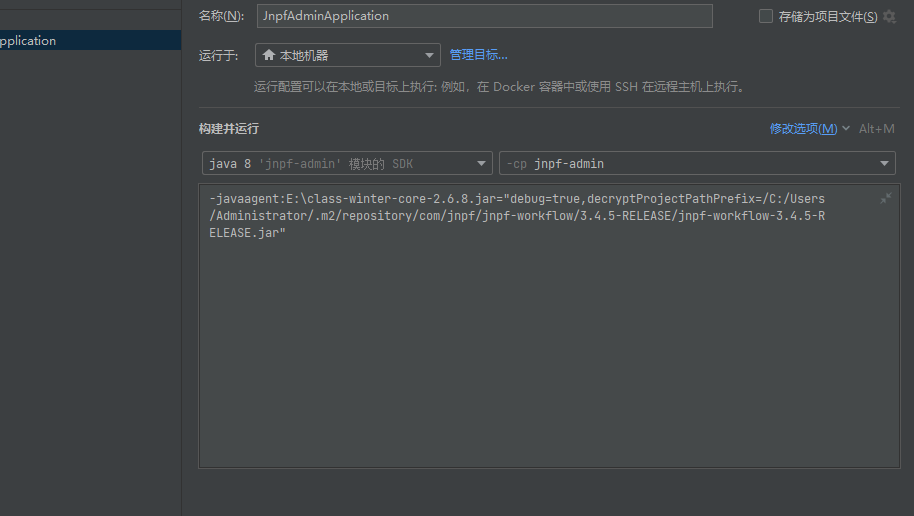
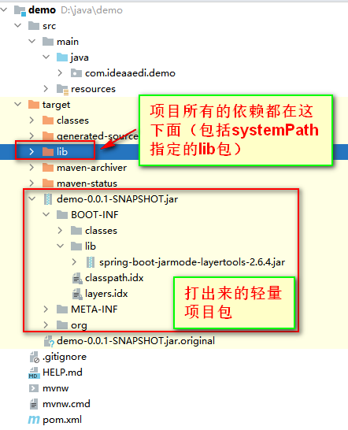

# 代码混淆之class-winter

- [代码混淆之class-winter](#代码混淆之class-winter)
  - [仓库最新版本](#仓库最新版本)
  - [环境要求](#环境要求)
  - [功能与特性](#功能与特性)
  - [加密](#加密)
  - [加密参数](#加密参数)
  - [解密(启动)](#解密启动)
  - [解密参数](#解密参数)
  - [对class-winter本身进行加密](#对class-winter本身进行加密)
  - [将已加密的包提供给客户使用](#将已加密的包提供给客户使用)
    - [方案](#方案)
    - [示例](#示例)
  - [功能扩展案例](#功能扩展案例)
  - [**FAQ**](#faq)
  - [QQ群](#qq群)

---

## 仓库最新版本
 <p>
  <a href="https://search.maven.org/search?q=g:com.idea-aedi%20a:class-winter-maven-plugin">
    
  </a>

**郑重声明**

[**class-winter**](https://gitee.com/JustryDeng/class-winter) 是本人在学习完 [**class-final(v1.1.9)**](https://gitee.com/roseboy/classfinal) 后，仿照class-final进行编写的，部分思路与class-final一致

## 环境要求

- 支持jdk8（8、11、17、21等）语法环境

  > **本人构建class-winter时，用的jdk版本为：`1.8.0_281`**

  注：tomcat版本不能低于8（部分小版本低的tomcat8可能也不行），否则可能报错
  
  ```bash
  org.apache.catalina.LifecycleException: Failed to start component [StandardEngine[Catalina].StandardHost...
  ```

  注：如果有兼容低版本jdk的需求，可以自己下载master分支代码，进行对应修改
  

## 功能与特性

- 支持war（普通war+可执行war）加密
- 支持jar（普通jar+可执行jar）加密
- 支持xml加密（掩耳盗铃版）

## 加密

- #### **方式一**：通过maven插件自动加密
  ```xml
  <!--
      class-winter插件
      注:自Maven3.0.3起, 绑定到同一phase的Maven插件将按照pom.xml中声明的顺序执行
      注:此插件最好放置在同一phase的最后执行。
      注:此插件不具备打包功能，需要在此插件前有打包插件进行项目打包，否则加密不会生效。
  -->
  <plugin>
      <groupId>com.idea-aedi</groupId>
      <artifactId>class-winter-maven-plugin</artifactId>
      <version>2.9.6</version>
      <!-- 相关配置 -->
      <configuration>
          <!-- <finalName></finalName>-->
          <includePrefix>加密范围</includePrefix>
          <!-- <originJarOrWar>非必填（不填则自动获取）</originJarOrWar>-->
          <!-- <excludePrefix></excludePrefix>-->
          <!-- <includeXmlPrefix></includeXmlPrefix>-->
          <!-- <excludeXmlPrefix></excludeXmlPrefix>-->
          <!-- <toCleanXmlChildElementName></toCleanXmlChildElementName>-->
          <!-- <password></password>-->
          <!-- <includeLibs></includeLibs>-->
          <!-- <alreadyProtectedRootDir></alreadyProtectedRootDir>-->
          <!-- <alreadyProtectedLibs></alreadyProtectedLibs>-->
          <!-- <supportFile></supportFile>-->
          <!-- <jvmArgCheck></jvmArgCheck>-->
          <!-- <tips></tips>-->
          <!-- <debug></debug>-->
      </configuration>
      <executions>
          <execution>
              <phase>package</phase>
              <goals>
                  <goal>class-winter</goal>
              </goals>
          </execution>
      </executions>
  </plugin>
  ```
  注：不必担心信息泄漏问题，使用此方式生成混淆的jar包时，会擦除pom.xml中关于class-winter-plugin的信息。
  
- #### **方式二**：通过[**class-winter-core.jar**](https://gitee.com/JustryDeng/class-winter/raw/master/class-winter-core/src/test/resources/class-winter-core-2.9.6.jar) 主动加密

  ```bash
  java -jar class-winter-core-2.9.6.jar originJarOrWar=${要加密的项目.jar或.war包} includePrefix=${加密范围} [k3=v3 k4=v4 ...]
  # 对于复杂的参数值，可以使用引号引起来
  # linux
  java -jar class-winter-core-2.9.6.jar k1='v1' k2='v2'
  # windows
  java -jar class-winter-core-2.9.6.jar k1="v1" k2="v2"
  ```

## 加密参数

> **提示：** 慎用`cca（尤其）`、`cma`、`cfa`参数，如果要用，请做好充分测试。
>
> 原因说明：部分框架在获取某些元数据时，并不全都从已被premain处理后的类中读取，而是直接去对应位置读取资源文件本身（如：spring的`SimpleMetadataReader implements MetadataReader`直接去读取.class文件本身，以知道是否需要将类注册进容器等），因为class-winter会对该位置的资源进行加密（如：使用cca、cma、cfa时会擦除类、方法、字段上的注解信息），因此此时如果直接去.class文件本身获取元信息的话，可能会丢失部分信息（如：被class-winter擦除了的类的注解信息就读取不到）
>
> 解决办法：可以考虑对相关逻辑进行定制，使其不从已加密的.class中获取相关信息（如：spring框架可考虑定制MetadataReader）

<table>
  <tr align="center">
    <td>参数</td>
    <td>是否必填</td>
    <td>说明</td>
    <td>示例</td>
  </tr>
  <tr align="center">
    <td>originJarOrWar</td>
    <td>是</td>
    <td>指定要加密的jar/war文件
        <br/>注：当使用maven插件进行自动加密时，此参数非必填，不填则自动获取。
        <br/>注：当使用maven插件进行自动加密时，可结合maven相关占位符进行相对定位。如：${project.basedir}/../../your-project.jar</td>
    <td>originJarOrWar=/my-project.jar</td>
  </tr>
    <tr align="center">
    <td>includePrefix</td>
    <td>是</td>
    <td>通过前缀匹配的形式定位要加密的class
      <br/> 注：也支持正则匹配（使用【.*】匹配所有而不用【*】）
      <br/> 注：多个通过逗号分割。
    </td>
    <td>includePrefix=com
    <br/>includePrefix=com,org
    <br/>includePrefix=com.*.dao,org
</td>
  </tr>
 <tr align="center">
    <td>cca（依托于includePrefix）</td>
    <td>否</td>
    <td>作为includePrefix的附加设置，设置是否清空类上的注解（写法同url后面设置参数）</td>
    <td>includePrefix=com?cca=true</td>
  </tr>
 <tr align="center">
    <td>cma（依托于includePrefix）</td>
    <td>否</td>
    <td>作为includePrefix的附加设置，设置是否清空方法上的注解（写法同url后面设置参数）</td>
    <td>includePrefix=com?cca=true&cma=true</td>
  </tr>
 <tr align="center">
    <td>cfa（依托于includePrefix）</td>
    <td>否</td>
    <td>作为includePrefix的附加设置，设置是否清空字段上的注解（写法同url后面设置参数）</td>
    <td>includePrefix=com?cca=true&cma=true&cfa=true</td>
  </tr>
<tr align="center">
    <td>caPrefix（依托于cca、cma、cfa开关）</td>
    <td>否</td>
    <td>作为includePrefix的附加设置，依托于cca、cma、cfa开关，清空类、方法、字段上的指定注解（写法同url后面设置参数）
      <br/> 注：多个通过|分割，注解请写完全路径例如：com.xx.anno.MyAnnotation  
    </td>
    <td>includePrefix=com?cca=true&cma=true&cfa=true&caPrefix=com.xx.anno.MyAnnotation|com.bb.anno.MyAnnotation</td>
  </tr>
<tr align="center">
    <td>keepArgName（依托于includePrefix）</td>
    <td>否</td>
    <td>作为includePrefix的附加设置，设置清空方法时，是否保留原始参数名，默认为true（写法同url后面设置参数）
      <br/> 注：keepArgName设置为false时，加密后方法的原始参数名信息将被擦除（不保证一定成功），反编译后查看到的将是形如var0, var1...之类的参数名（不同反编译工具的默认参数名可能不一样）  
    </td>
    <td>includePrefix=com?keepArgName=false</td>
 </tr>
 <tr align="center">
    <td>excludePrefix</td>
    <td>否</td>
        <td>通过前缀匹配的形式排除class，不对其加密
             <br/> 注：也支持正则匹配（使用【.*】匹配所有而不用【*】）
             <br/> 注：多个通过逗号分割。
             <br/> 注：excludePrefix优先级高于includePrefix。
        </td>
    <td>excludePrefix=com.example.service,com.example.util.*.class</td>
  </tr>
      </tr>
    <tr align="center">
    <td>includeXmlPrefix</td>
    <td>否</td>
    <td>通过打出来的包中条目的entryName前缀匹配的形式定位要加密的xml
        <br/> 注：也支持正则匹配（使用【.*】匹配所有而不用【*】）
        <br/> 注：多个通过逗号分割。    
        <br/> 注：如果您打出来的加密包是准备作为一个lib包提供给第三方使用的，那么请不要使用此参数，因为解密时是不会解密项目所依赖的lib包中的xml的。
    </td>
    <td>includeXmlPrefix=BOOT-INF/classes/
    <br/>
includeXmlPrefix=BOOT-INF/classes/com/demo/mapper/,BOOT-INF/classes/com/*/dao/</td>
  </tr>
  </tr>
    <tr align="center">
    <td>excludeXmlPrefix</td>
    <td>否</td>
    <td>通过打出来的包中条目的entryName前缀匹配的形式排除xml，不对其加密
       <br/> 注：也支持正则匹配（使用【.*】匹配所有而不用【*】）
    <br/>
注：多个通过逗号分割。</td>
    <td>excludeXmlPrefix=BOOT-INF/classes/com/demo/mapper/
    <br/>
excludeXmlPrefix=BOOT-INF/classes/com/demo/mapper/,BOOT-INF/classes/com/demo/*/UserDao.xml</td>
  </tr>
  </tr>
    <tr align="center">
    <td>toCleanXmlChildElementName</td>
    <td>否</td>
    <td>加密xml中的哪些一级元素
    <br/>
注：默认值为resultMap,sql,insert,update,delete,select
    <br/>
注：多个通过逗号分割。</td>
    <td>toCleanXmlChildElementName=select,delete,resultMap</td>
  </tr>
    <tr align="center">
    <td>finalName</td>
    <td>否</td>
    <td>指定加密后生成的jar包名
    <br/>
注：若finalName与加密的包一致，那么生成的加密后的包会覆盖原来的包。<br/>
注：支持相对路径。 比如:../../tmp/my-project 就会在相对目录../../tmp下生成加密包my-project.jar。</td>
    <td>finalName=mine-project</td>
  </tr>
    <tr align="center">
    <td>password</td>
    <td>否</td>
    <td>主动指定密码
    <br/>
注：密码不能包含空格和逗号。</td>
    <td>password=123456</td>
  </tr>
    <tr align="center">
    <td>includeLibs</td>
    <td>否</td>
    <td>指定将lib包也纳入加密范围内
      <br/> 注：也支持正则匹配（使用【.*】匹配所有而不用【*】）
      <br/> 注：多个通过逗号分割。
      <br/> 注：lib中的class是否会被加密，还得由includePrefix和excludePrefix决定。
    </td>
    <td>includeLibs=a.jar,b.jar,c-.*.jar</td>
  </tr>
    <tr align="center">
    <td>alreadyProtectedRootDir</td>
    <td>否</td>
    <td>指明已加密lib包所在根目录(，可为空，为空时自动根据当前是jar还是war，去包内对应找lib)
    <br/>
注：当指定此参数时，也会优先去jar/war内部找对应的lib包，找不到时，才会去此参数指定的根目录下找lib包。
<br/>
注：在一些外置lib的项目中，可能需要用到此参数；如果是内置lib，忽略此参数即可。
<br/>注：此参数由2.7.0版本开始支持</td>
    <td>alreadyProtectedRootDir=/lib</td>
  </tr>
    <tr align="center">
    <td>alreadyProtectedLibs</td>
    <td>否</td>
    <td>指明项目所依赖的lib中，哪些lib本身就已经是被class-winter加密了的
    <br/>
注：多个通过逗号分割。
<br/>
注：主要用于处理第三方提供的由class-winter加密了的依赖包的场景。
<br/>
注：若lib需要密码，那么需要在指定lib的同时通过冒号接上密码。
<br/>
注：如果lib有密码，那么密码不能包含逗号。</td>
    <td>alreadyProtectedLibs=a.jar,b-1.0.0.jar
    <br/>
alreadyProtectedLibs=a.jar,b-1.0.0.jar:pwd123
<br/>
alreadyProtectedLibs=a.jar:pwd1,b-1.0.0.jar:pwd2</td>
  </tr>
    <tr align="center">
    <td>supportFile</td>
    <td>否</td>
    <td>指定一个加密辅助jar文件（或jar文件所在的目录）
    <br/>
注：当为目录时，该目录（含子孙目录）下的所有jar都会被采集作为辅助文件。
<br/>
注：主要用于解决因ClassNotFound导致的加密失败问题。</td>
    <td>supportFile=/abc.jar
    <br/>
supportFile=/libs</td>
  </tr>
    <tr align="center">
    <td>jvmArgCheck</td>
    <td>否</td>
    <td>设置当启动混淆包时，必须要有的jvm参数
    <br/>
注：多个通过逗号分割。
<br/>
注：大小写不敏感。
<br/>
如:通过设置-XX:+DisableAttachMechanism防止运行时dump class，以提高安全性。</td>
    <td>jvmArgCheck=-XX:+DisableAttachMechanism,-Xms2048M</td>
  </tr>
    <tr align="center">
    <td>tips</td>
    <td>否</td>
    <td>指定提示语。
    <br/>
注：当直接使用加密后的jar/war时，用到了加密了的类后，会先System.err.println输出此tips,然后System.exit退出程序。</td>
    <td>windows示例：tips="请不要直接使用混淆后的jar/war"
<br/>
linux示例：tips='请不要直接使用混淆后的jar/war'</td>
  </tr>
    <tr align="center">
    <td>debug</td>
    <td>否</td>
    <td>是否开启debug模式</td>
    <td>debug=true</td>
  </tr>
</table>


## 解密(启动)

> `class-winter`支持`JVM`参数校验，通过在JVM参数中加入`-XX:+DisableAttachMechanism`来防止其他工具连接到你的Java程序。这样可以阻止运行至dump class。
> 
> 但是有些高级开发者可能会想要使用`sa-jdi` 的 `HSDB` 来 `dump` 字节码。从`2.8.8`版本开始，支持在启动Java解密时禁用了gHotSpotVMStructs函数，避免使用sa-jdi HSDB 来dump class，提高代码安全性。
- #### jar解密(启动)
  ```bash
  # 假设your-project-encrypted.jar是由class-winter加密后的包，那么你可以这么启动
  java -javaagent:/your-project-encrypted.jar -jar /your-project-encrypted.jar
  # 也可以用class-winter-core-2.9.6.jar
  # java -javaagent:/class-winter-core-2.9.6.jar -jar /your-project-encrypted.jar
  # 或者指定参数
  # java -javaagent:/your-project-encrypted.jar=debug=true,password=pwd12345 -jar /your-project-encrypted.jar
  # 参数可以引起来(linux)
  # java -javaagent:/your-project-encrypted.jar='debug=true,password=pwd12345' -jar /your-project-encrypted.jar
  # 参数可以引起来(windows)
  # java -javaagent:/your-project-encrypted.jar="debug=true,password=pwd12345" -jar /your-project-encrypted.jar
  ```

- #### war解密(启动)
  > **以Tomcat9为例**
  - linux方式一

    编辑tomcat/bin/catalina.sh文件，在最上面加上

    ```bash
    # 如果你有参数， 那么 -javaagent:/class-winter-core-2.9.6.jar=k1=v1,k2=v2
    # tomcat启动往往需要通过decryptProjectPathPrefix指定要解密的路径
    CATALINA_OPTS="$CATALINA_OPTS -javaagent:/class-winter-core-2.9.6.jar=debug=true,decryptProjectPathPrefix=/usr/local/xxx/";
    export CATALINA_OPTS;
    ```
  
  - linux方式二
  
    在tomcat/bin目录下创建setenv.sh文件，并写上
  
    ```bash
    # 如果你有参数， 那么 -javaagent:/class-winter-core-2.9.6.jar=k1=v1,k2=v2
    # tomcat启动往往需要通过decryptProjectPathPrefix指定要解密的路径
    JAVA_OPTS="$JAVA_OPTS -javaagent:/class-winter-core-2.9.6.jar=debug=true,decryptProjectPathPrefix=/usr/local/xxx/";
    export JAVA_OPTS;
    ```

  - windows方式一

    编辑tomcat/bin/catalina.bat文件，在@echo off后加上catalina参数
  
    ```bash
    rem 如果你有参数， 那么 -javaagent:D:/class-winter-core-2.9.6.jar=k1=v1,k2=v2
    rem tomcat启动往往需要通过decryptProjectPathPrefix指定要解密的路径
    set CATALINA_OPTS="-javaagent:D:/class-winter-core-2.9.6.jar=decryptProjectPathPrefix=/D:/tmp/"
    ```
  
  - windows方式二
  
    在tomcat/bin目录下创建setenv.bat文件，并写上
  
    ```bash
    rem 如果你有参数， 那么 -javaagent:D:/class-winter-core-2.9.6.jar=k1=v1,k2=v2
    rem tomcat启动往往需要通过decryptProjectPathPrefix指定要解密的路径
    set JAVA_OPTS="-javaagent:D:/class-winter-core-2.9.6.jar=decryptProjectPathPrefix=/D:/tmp/"
    ```
  
- #### IDE解密(启动)

  > 设置`-javaagent`参数指定class-winter-core或者任一加密包。有必要的话，再搭配`skipProjectPathPrefix`或者`decryptProjectPathPrefix`参数启动即可

  


## 解密参数

<table>
  <tr align="center">
    <td>参数</td>
    <td>是否必填</td>
    <td>说明</td>
    <td>示例</td>
  </tr>
  <tr align="center">
    <td>password</td>
    <td>否</td>
    <td>指定解密密码</td>
    <td>password=pwd123</td>
  </tr>
  <tr align="center">
    <td>passwordFromFile</td>
    <td>否</td>
    <td>从指定文件中读取文本作为解密密码<br/>注：此参数由2.4.0版本开始支持</td>
    <td>passwordFromFile=/my-pwd-file.txt</td>
  </tr>
      <tr align="center">
    <td>passwordFromShell</td>
    <td>否</td>
    <td>执行shell文件中的代码，并以其返回值作为解密密码<br/>注：此参数由2.4.0版本开始支持</td>
    <td>passwordFromShell=/my-pwd-file.shell</td>
  </tr>
    <tr align="center">
    <td>skipProjectPathPrefix</td>
    <td>否</td>
    <td>是否跳过指定前缀的项目路径（当class-winter解密逻辑试图解析那些进入premain但是非class-winter加密项目时，会因为获取印章失败Obtain project seal fail而停止，此时如果确认这个项目没有加密文件的话，可以使用此参数跳过）<br/>注：值中的路径分隔符请统一使用/ <br/>注：不知道此值怎么填的，可以把debug代开， 观察日志 Exist projectPath -> xxx，从输出的所有projectPath中找到加密包的路径 <br/>注：此参数由2.6.4版本开始支持</td>
    <td>
        skipProjectPathPrefix=/D:/apache-tomcat-9.0.71/bin/
        <br/>
        多个通过___符号拼接：skipProjectPathPrefix=/D:/apache-tomcat-9.0.71/bin/___/D:/jd/classpath/lib/</td>
  </tr>
  </tr>
    <tr align="center">
    <td>decryptProjectPathPrefix</td>
    <td>否</td>
    <td>是否仅解密指定前缀的项目路径（优先级低于skipProjectPathPrefix）<br/>注：值中的路径分隔符请统一使用/ <br/>注：不知道此值怎么填的，可以把debug代开， 观察日志 Exist projectPath -> xxx，从输出的所有projectPath中找到加密包的路径 <br/>注：此参数由2.6.6版本开始支持</td>
    <td>
        decryptProjectPathPrefix=/D:/apache-tomcat-9.0.71/bin/
        <br/>
        多个通过___符号拼接：decryptProjectPathPrefix=/D:/apache-tomcat-9.0.71/bin/___/D:/jd/classpath/lib/</td>
  </tr>
  </tr>
    <tr align="center">
    <td>debug</td>
    <td>否</td>
    <td>是否开启debug模式</td>
    <td>debug=true</td>
  </tr>
</table>

## 对class-winter本身进行加密

> 感谢小伙伴[Mango](https://gitee.com/mango_ye)对class-winter的优质反馈

- 背景说明：我们利用class-winter混淆项目时，项目是被混淆了，但是class-winter本身还是明文的，这就留下了一些安全隐患（即：那些不指定密码的混淆，可能会被反向破解）
- 增强支持：我们可以对class-winter本身进行加密，你可以切换至`enhance-*`分支，在首页下载被混淆的class-winter进行测试，或者clone代码，install后进行测试
- **声明**：因为在`enhance-*`分支里对class-winter本身进行加密时用到了收费工具allatori（实际上有供学习使用的破解版之类的），所以`enhance-*`分支的代码，本人并未发布至maven官方仓库


## 将已加密的包提供给客户使用

### 方案

- 方案一（适用于encrypted-A依赖于encrypted-B.jar，启动encrypted-A的情况）

  >  提示：此方式也适用于不加密A的情况，在A里的class-winter配置你只需要指定一个不存在的includePrefix即可

  class-winter加密时，使用`alreadyProtectedLibs`参数，但是要求客户的项目也需要使用class-winter加密（，哪怕客户的项目什么也不需要加密，也要求客户有使用class-winter这个动作）

- 方案二（适用于A依赖于encrypted-B.jar，启动A的情况）

  利用`-Dloader.path`或其它方案，将encrypted-B.jar外置，并通过`decryptProjectPathPrefix`或`skipProjectPathPrefix`来定位encrypted-B.jar

### 示例

> 提示：这里以可执行的jar进行的示例，其余的外置方式也是可以的（如：tomcat部署war包解压后，lib包就相当于是外置的）

以`-Dloader.path`实现，将encrypted-B.jar外置到项目包A外

- 假设客户依赖了我们的加密包

  

  - 客户使用maven插件，打包时将项目代码和依赖的lib分开

    完整pom示例：

    ```xml
    <?xml version="1.0" encoding="UTF-8"?>
    <project xmlns="http://maven.apache.org/POM/4.0.0" xmlns:xsi="http://www.w3.org/2001/XMLSchema-instance"
             xsi:schemaLocation="http://maven.apache.org/POM/4.0.0 https://maven.apache.org/xsd/maven-4.0.0.xsd">
        <modelVersion>4.0.0</modelVersion>
        <parent>
            <groupId>org.springframework.boot</groupId>
            <artifactId>spring-boot-starter-parent</artifactId>
            <version>2.6.4</version>
            <relativePath/> <!-- lookup parent from repository -->
        </parent>
        <groupId>com.example</groupId>
        <artifactId>demo</artifactId>
        <version>0.0.1-SNAPSHOT</version>
        <name>demo</name>
        <description>Demo project for Spring Boot</description>
        <properties>
            <java.version>1.8</java.version>
        </properties>
        <dependencies>
            <dependency>
                <groupId>org.springframework.boot</groupId>
                <artifactId>spring-boot-starter-web</artifactId>
            </dependency>
  
            <dependency>
                <groupId>org.projectlombok</groupId>
                <artifactId>lombok</artifactId>
                <optional>true</optional>
            </dependency>
            <dependency>
                <groupId>org.springframework.boot</groupId>
                <artifactId>spring-boot-starter-test</artifactId>
                <scope>test</scope>
            </dependency>
  
            <dependency>
                <groupId>com.demo</groupId>
                <artifactId>encrypted-lib-no-pwd</artifactId>
                <scope>system</scope>
                <version>1.0.0</version>
                <systemPath>${pom.basedir}/src/main/resources/lib/encrypted-lib-no-pwd-1.0.0.jar</systemPath>
            </dependency>
        </dependencies>
  
        <build>
            <plugins>
                <plugin>
                    <groupId>org.springframework.boot</groupId>
                    <artifactId>spring-boot-maven-plugin</artifactId>
                    <configuration>
                        <!-- 指定该Main Class为全局的唯一入口 -->
                        <mainClass>com.ideaaedi.demo.DemoApplication</mainClass>
                        <!-- 把systemPath指定的jar包也纳入lib -->
                        <includeSystemScope>true</includeSystemScope>
                        <fork>true</fork>
                        <!-- 设置为ZIP，此模式下spring-boot-maven-plugin会将MANIFEST.MF文件中的Main-Class设置为org.springframework.boot.loader.PropertiesLauncher -->
                        <layout>ZIP</layout>
                        <includes>
                            <include>
                                <groupId>nothing</groupId>
                                <artifactId>nothing</artifactId>
                            </include>
                        </includes>
                    </configuration>
                    <executions>
                        <execution>
                            <goals>
                                <goal>repackage</goal>
                            </goals>
                        </execution>
                    </executions>
                </plugin>
  
                <!-- 通过插件将所有依赖的lib包放到编译后的target/lib目录，并且在打包时候排除内部依赖 -->
                <plugin>
                    <groupId>org.apache.maven.plugins</groupId>
                    <artifactId>maven-dependency-plugin</artifactId>
                    <version>3.2.0</version>
                    <executions>
                        <execution>
                            <id>copy-dependencies</id>
                            <phase>prepare-package</phase>
                            <goals>
                                <goal>copy-dependencies</goal>
                            </goals>
                            <configuration>
                                <outputDirectory>${project.build.directory}/lib</outputDirectory>
                                <overWriteReleases>false</overWriteReleases>
                                <overWriteSnapshots>false</overWriteSnapshots>
                                <overWriteIfNewer>true</overWriteIfNewer>
                                <!-- 如果你想把systemPath指定的jar包也纳入lib，可以设置includeScope为compile -->
                                <!-- <includeScope>compile</includeScope> -->
                                <includeScope>runtime</includeScope>
                            </configuration>
                        </execution>
                    </executions>
                </plugin>
            </plugins>
        </build>
  
    </project>
    ```

    打出来的包：

    

- 客户可以这样启动项目

  > `java -Dloader.path=./lib/ -javaagent:./{class-winter.jar} -jar {客户项目.jar}`

  


## 功能扩展案例

> 感谢以下小伙伴们的优秀扩展案例

| 序号   | 扩展功能   | 作者                                                         | 仓库地址                                                    |
| ------ | ---------- | ------------------------------------------------------------ | ----------------------------------------------------------- |
| 1      | 机器码支持 | qq号：`85546017`<br /><br />当前（2023-06-11）状态：<br />&emsp;qq名：`╮(╯_╰)╭`<br />&emsp;是否在class-winter QQ群：是 | [点击跳转](https://gitee.com/tts2/class-winter/tree/master) |
| ...... | ......     | ......                                                       | ......                                                      |


## **FAQ**

> class-winter初始能力设计理念是，只做通用能力支持，如果没法做到通用，那就干脆不做，需要的话使用者自行扩展

- **1. 加密失败并伴有` Ignore clear-method-body for className [xxx], Cannot find 'yyy'`提示**

  - 原因：类`xxx`中使用到了类`yyy`，但是被加密包中不存在`yyy`类

  - 解决方案1：在`xxx`中引入`yyy类`（或引入`yyy所在包`）

  - 解决方案2：通过加密参数supportFile指定`yyy`所在包为加密辅助包

    注：使用supportFile时，尽量控制指定范围，如果指定的范围太大（如无脑指定整个依赖仓库），引入的相关包太多，可能导致一些意料外的加密问题。如：[issues I9VTG9](https://gitee.com/JustryDeng/class-winter/issues/I9VTG9)

- **2. 是否支持yml等配置文件加密？**

  **不支持。**

  不同的框架加载配置文件的方式不一样，没法写一个通用的加密逻辑，需要的话自行根据所用技术框架自行实现

- **3. 是否支持对lib包里的xml加密？**

  **不支持。**

  首先实现起来相对麻烦，其次即便是（通用）加密也是伪加密。除非自己根据框架进行扩展进行定制加密

- **4. 部分版本spring-boot为啥加密后，启动时读取配置文件内容失败？**

  **配置文件使用.yaml或.properties无此问题；部分版本的spring-boot使用.yml配置文件可能出现部分配置读取失败。**

- **5. 启动时明明按要求指定了JVM参数，为啥还是提示Miss jvm arg？**

  **JVM参数位置不对，要放在-jar xxx.jar之前**

  ```bash
  # 错误案例
  java -javaagent:cc-encrypted.jar -jar cc-encrypted.jar -XX:+DisableAttachMechanism
  # 正确案例
  java -javaagent:cc-encrypted.jar -XX:+DisableAttachMechanism -jar cc-encrypted.jar 
  ```

- **6. class-winter是否支持对类名、字段名、方法名等进行混淆？**

  **不支持。**

  需要的话，可结合其它混淆工具（如：allatori等）一起加密，可参考enhance分支

- **7. includeLibs指定了要加密的lib包，为啥没生效？**

  - **如果配置时使用的前缀匹配：** 首先检查指定的前缀是否包含住了指定了lib名，然后检查includePrefix匹配范围是否包含lib中的class

  - **如果配置时使用的模糊匹配：** 首先检查正则语法是否配置正确（见：FAQ-8），然后检查includePrefix匹配范围是否包含lib中的class

- **8. 模糊匹配，正则未生效？**

  **如果用正则的话，使用【`.*`】匹配所有而不用【`*`】**

  你可以这么验证自己的正则是否配置对
  ```java
  System.err.println(java.util.regex.Pattern.compile("aab.*bcc").matcher("aabXYZbcc").find()); // 输出true则说明正则写法无误
  ```

- **9. decryptProjectPathPrefix值如何指定？**
``
  > 请确保先看过了上面【解密参数】里对此参数的说明及示例

  decryptProjectPathPrefix指定的值，将以前缀匹配的形式匹配要解密的文件。
  
  - 如果你是war包，那么你可以指定war包解压后对应的war目录
  - 如果你是jar包（all-in-one），那么无需指定此参数
  - 如果你是jar包（lib外置），那么直接指定对应需要解密的lib文件即可
  - 如果你没有任何头绪，那么你可以先不指定decryptProjectPathPrefix，直接debug启动项目，当因解密失败启动报错时，会debug输出形如**Exist projectPath -> xxx**的信息，该`xxx`即为当前解密失败的文件路径，你可以根据这个路径去反推你的decryptProjectPathPrefix值，然后配置该decryptProjectPathPrefix值再启动即可
  
- **10. 不解密，直接调用加密包中类的方法时，部分类会有报错形如`java.lang.ClassFormatError: Illegal local variable table start_pc 33 in method 'int xxx.yyy.zzz.IOUtil.copy(java.lang.String)'`？**

  - 代码表象：class-winter使用javassist在保留方法原始参数名的情况下加密方法（清空方法体）时，处理不足
  - 原因猜测1：javassist加密后字节码的本地变量表、字面量和jvm优化后的本地变量表、字面量存在差异，进而导致此问题
  - 原因猜测2：class-winter中的保留原始参数名清空方法体`JavassistUtil#clearMethodBodyKeepOriginArgName`方法存在问题（P.S.本人水平有限，没有从这个方法中找到问题）
  
  - 解决方案1：设置加密参数`keepArgName=false`，加密清空方法体时不保留方法原参数名
  - 解决方案2：根据报错信息，找到对应的方法；1. 检查该方法，去掉多余的局部变量； 2.将该方法中的复杂写法改为简单写法
  - 解决方案3：根据报错信息，找到对应的方法；将该方法单独提取到其它类中，这样虽然调用该方法所在的类还是会报错，但是调用原类（中的其它方法）就不会报错了

## QQ群

> 群号：727930548


